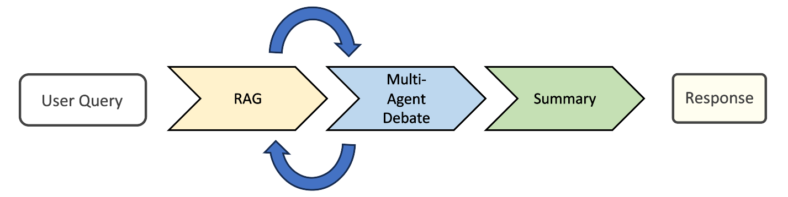
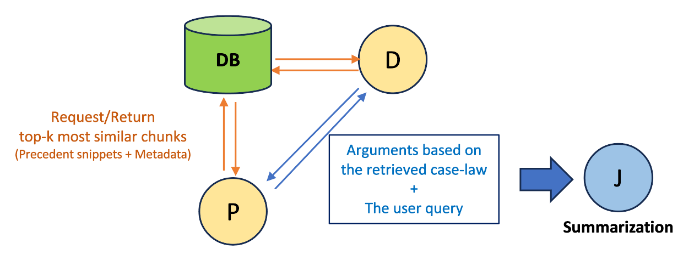

# Legal-RAG

A system for legal research, which simulates courtroom debates using LLM agents and RAG.

## Overview
The American legal system follows common law, meaning that judicial decisions are, to a large degree, based on precedents set by previous rulings. 
In preparation for a case, lawyers have to do extensive research on these previous rulings to support their arguments.
This work uses LLM agents in conjunction with RAG to assist in this labor-intensive process.
The user prompts the system with a legal inquiry, which is then discussed by two agents, representing opposing lawyers in court.
Using criminal law as an example, one agent acts as a defense lawyer, whereas the other takes the role of the prosecution.
These lawyer-agents support their arguments through RAG, by querying a vector database made up of a case law corpus. 
After a few turns, the discussion ends and the conversation is summarized by a judge agent. 
Thus, the final answer not only provides relevant case law, but also considers how the other side might argue against it.



## Data and RAG

The data for this process was sourced from [CourtListener](courtlistener.com), a public repository of court rulings.
Documents are pulled using the CourtListener API, chunked using LangChain's spaCy text splitter, and added to a Chroma vector database along with metadata on ruling dates and jurisdictions.

## Agents

The agent infrastructure  serves to orchestrate the multi-agent reasoning process, where multiple role-specific agents adaptively simulate legal proceedings. 
Within this system, three primary agents, representing prosecution, defense, and a judge, are utilized. 
The prosecution agent's role is to argue for conviction, whereas the defense agent is tasked with arguing in favor of the defendant. 
Finally, the judge agent operates as a neutral party, summarizing the entire debate and evaluating the accuracy and relevance of the citations presented by the prosecution and defense agents. 

#### Prompt Design
To optimize agent behavior, we analyzed how lawyers acted in real cases.
Three Supreme Court criminal cases were selected to represent diverse legal domains: 
Samia v. United States addressing Confrontation Clause issues, Betterman v. Montana concerning Sixth Amendment speedy trial rights, and Glossip v. Oklahoma involving death penalty procedures and prosecutorial misconduct. 
Oral argument transcripts from these cases were systematically analyzed to identify recurring patterns in advocate behavior, judicial intervention styles, citation formats, cross-examination techniques, and objection handling protocols. 
This analysis revealed distinct strategic priorities employed by prosecution and defense counsel, with prosecution consistently leading with strongest evidence and framing issues narrowly, while defense led with constitutional violations and framed issues broadly to expand protective precedents.

The initial prompt development phase produced structured prompts for three primary agent roles: prosecution, defense, and judge. 
Each agent prompt contained role definitions specifying primary objectives, strategic priorities derived from Supreme Court transcript analysis, a four-phase argumentation structure covering opening statements through closing arguments, case law citation requirements with triggers for requesting legal research, objection protocols specifying proper format and grounds, and ethical constraints reflecting professional responsibility rules. 
Strategic priorities were deliberately grounded in observed advocate behavior rather than theoretical legal strategy, ensuring realistic courtroom argumentation patterns.

Supporting protocols were developed to govern multi-agent interaction, including a turn-taking protocol establishing structured courtroom procedure, a RAG Integration Protocol defining a seven-step process for handling agent-generated search requests, response format guidelines providing structural templates, citation format examples demonstrating proper legal citation styles, and an error recovery protocol providing coordinator intervention procedures. 
Quality checklists were developed for each agent role with pre-submission verification points and red flag warnings for common errors.

#### RAG Integration

The RAG loop implementation follows as a two-step process.
In the first step, the agent is prompted to generate RAG queries based on conversation history using the "[SEARCH: query text]" format.
These queries are used to retrieve the $k$-nearest matches from the vector database, which are fed back into the prompt as context along with the corresponding case names.
In the second step, the agent is then instructed to respond based on the retrieved context.
This approach ensures agents maintain conversation context throughout retrieval, building arguments iteratively with progressively refined case law research.




## Installation
This project uses [uv](https://docs.astral.sh/uv/) for managing Python dependency.
For a guide on how to use it to set up the project, consult the `SETUP.md` in `docs/`.

In the same directory, `pulling_data.md` provides information about pulling the necessary data.
This requires access to the CourtListener API. Go to `courtlistener.com` and create an account. Then navigate to `Account > Developer Tools > Your API Token` to find your API key.

In your local repository, create a file named `.env`, and add the following line, replacing `your api key here` with your API key:

```
COURTLISTENER_API_KEY=your_api_key_here
```

Currently, this project uses Llama via [GROQ](https://groq.com/).
To run the system, you will likewise need a GROQ API key.
Same as with CourtListener, place the key in the `.env` file:
 
```
GROQ_API_KEY=your_api_key_here
```
